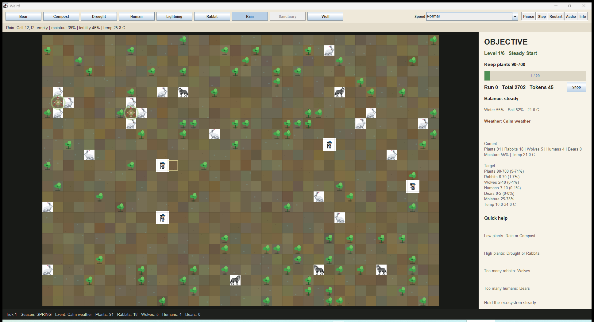
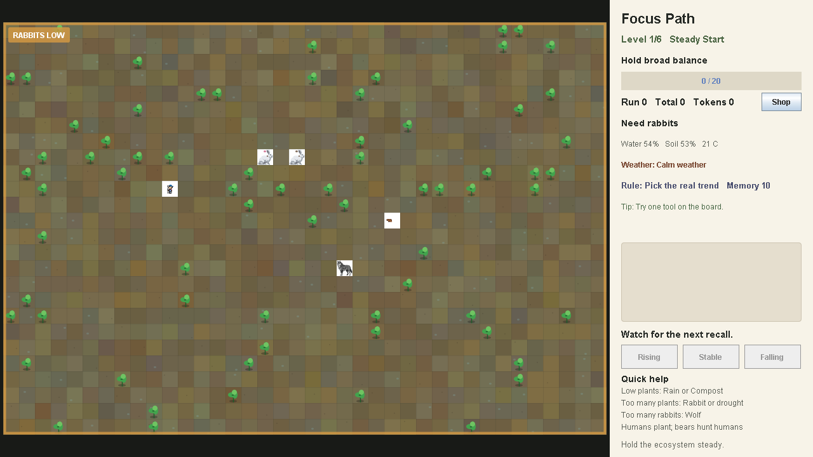
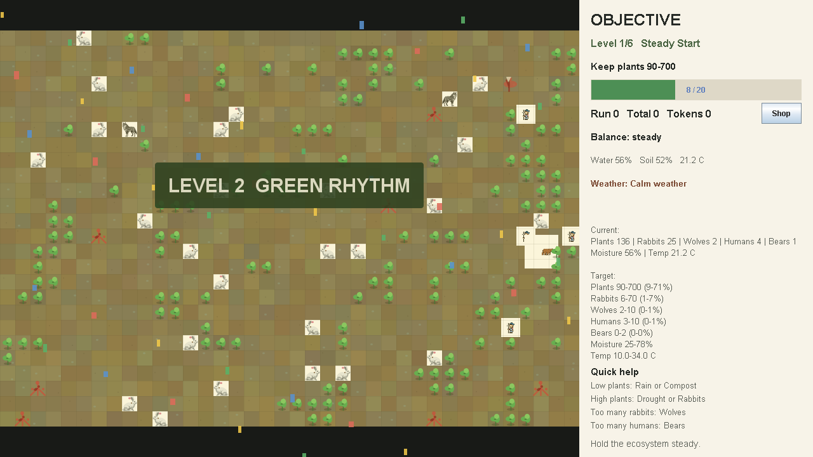

# Weird

A small Java terrarium simulation. Plants grow from soil conditions, rabbits graze on plants, humans plant new growth, and wolves and bears shape the balance. The player acts as a gardener by changing the environment or adding species to the board.

The current version includes illustrated terrain and wildlife, six balance-maintenance levels, adaptive recall prompts, changing weather events, a persistent score and upgrade shop, veteran animals, death animations, and ecosystem stability goals.

## Current build

- Java 17
- Java Swing
- No external dependencies

## Run in IntelliJ

1. Open this repository folder in IntelliJ IDEA.
2. Use the `Weird` run configuration.
3. Run the project.

## Run from PowerShell

```powershell
.\scripts\run.ps1
```

The build output goes into `out/`, which is ignored by Git.

## Build a release

```powershell
.\scripts\release.ps1
```

This creates `release\Weird-release.zip` with a runnable Windows app image and the bundled music file.

## Check

```powershell
.\scripts\check.ps1
```

This runs a small simulation smoke check without installing a test framework.

For an offscreen render check:

```powershell
.\scripts\visual-check.ps1
```

It writes `out/visual-check.png`.

To briefly open and capture the real Swing window:

```powershell
.\scripts\window-check.ps1
```

It writes `out/window-check.png`.

## Screenshots







The same gallery is published in `docs/index.md` for the GitHub Pages view.

## Controls

- `Rain` adds moisture around the clicked cell.
- `Drought` dries the clicked area.
- `Compost` raises fertility in a small area.
- `Plant`, `Rabbit`, and `Wolf` place one organism on an empty clicked cell.
- `Human` plants nearby soil.
- `Bear` is a rare visitor that appears based on human population.
- `Sanctuary` is purchased in the shop and protects one 2 x 2 soil patch per run.
- `Pause` stops the timer.
- `Step` advances one tick.
- `Speed` changes the simulation pace.
- `Restart` starts a fresh terrarium and training session.
- `Audio` opens persistent music and effect-volume settings.

Keyboard controls:

- `1` to `7` select gardener tools.
- `Space` pauses or resumes.
- `N` advances one tick.
- `R` restarts the run.

Move the pointer over the board to inspect moisture, fertility, temperature, and the current occupant.

Wet soil shows cool highlights, dry soil develops small cracks, and sanctuary cells have a gold border. Rabbits, wolves, humans, plants, bears, and veteran animals each have a distinct board silhouette.

## Focus training

- Six levels give the run a clear objective. Each level asks you to keep the ecosystem inside a target balance band, then press `Next Level`.
- Recall questions ask whether a selected population was rising, stable, or falling.
- Recall lookback grows from 10 to 20 and then 32 ticks as the answer streak improves.
- Later levels can reverse the recall rule and ask for the opposite trend.
- Level changes appear briefly over the board with a stronger celebration animation.
- Ecosystem crises add a bold labeled border and an always-visible warning strip.
- Older rabbits and wolves become veterans with a silver marker. Hovering reveals their age and energy.
- Deaths fade out over about 2.8 seconds, and human deaths use a harsher sound cue.
- Run score resets with the terrarium. Total score and tokens persist in `data/progress.properties`.

## Risk and failure

Rain, Drought, and Compost have strong local effects. Repeated use can flood the terrarium, create lethal dry soil, or trigger uncontrolled plant growth.

A crisis warning appears after five consecutive dangerous ticks. If extinction, runaway rabbits, flooding, lethal dryness, lethal temperature, or human collapse continues for 14 ticks, the current level is lost. `Restart Level` rebuilds the terrarium on the same level and deducts 15 run-score points. Restarting the whole run shows a confirmation warning.

Ambient music and sound effects are generated through built-in Java Sound. Audio failure never prevents the simulation from running.

Design decisions and their supporting studies are recorded in `docs/research-backed-production.md`. These sources guide the interface but do not make the game a clinically validated treatment.

## Shop

Level rewards and correct recall answers grant tokens without reducing total score. The shop contains permanent upgrades:

- `Sanctuary Permit` unlocks the protected soil tool.
- `Rain Barrel` increases Rain strength by 50%.
- `Rich Compost` increases Compost strength by 50%.
