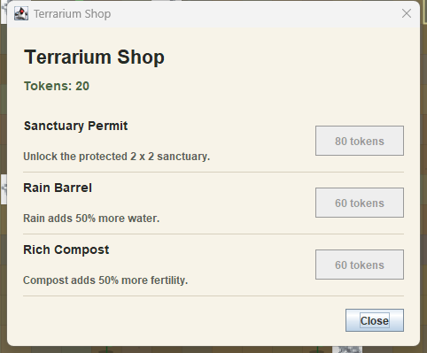
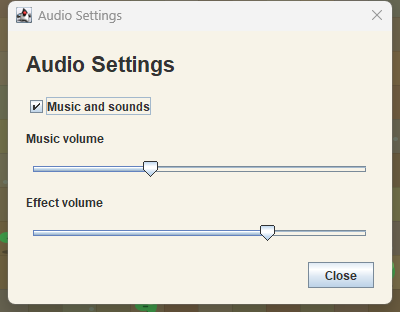

# Weird

Small Java terrarium simulation with balance-maintenance levels, weather tools, a session-only shop, and a readable objective panel.

## Screenshots






## Run

Open the repository in IntelliJ IDEA and run the `Weird` configuration, or use:

```powershell
.\scripts\run.ps1
```

## Checks

```powershell
.\scripts\check.ps1
.\scripts\visual-check.ps1
.\scripts\window-check.ps1
```
